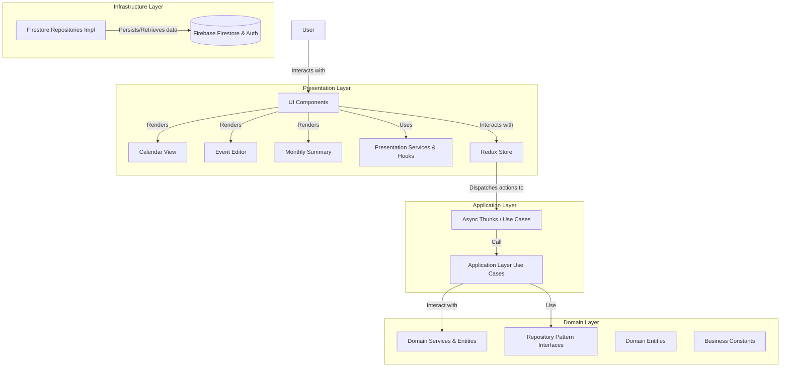
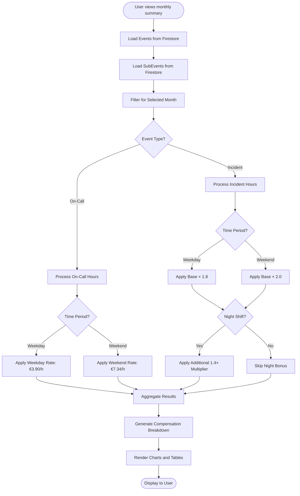
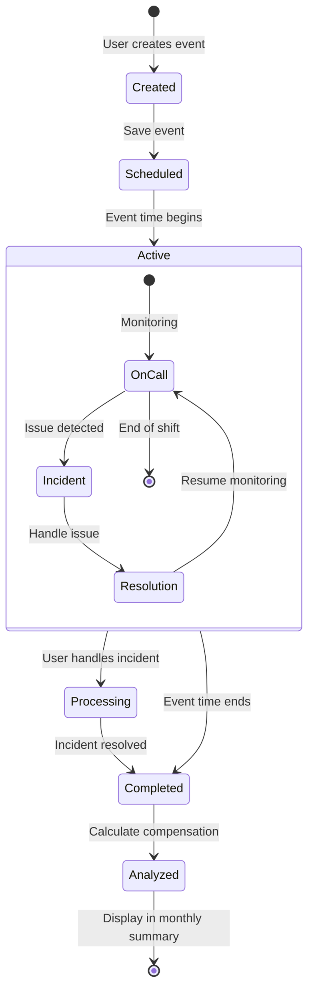
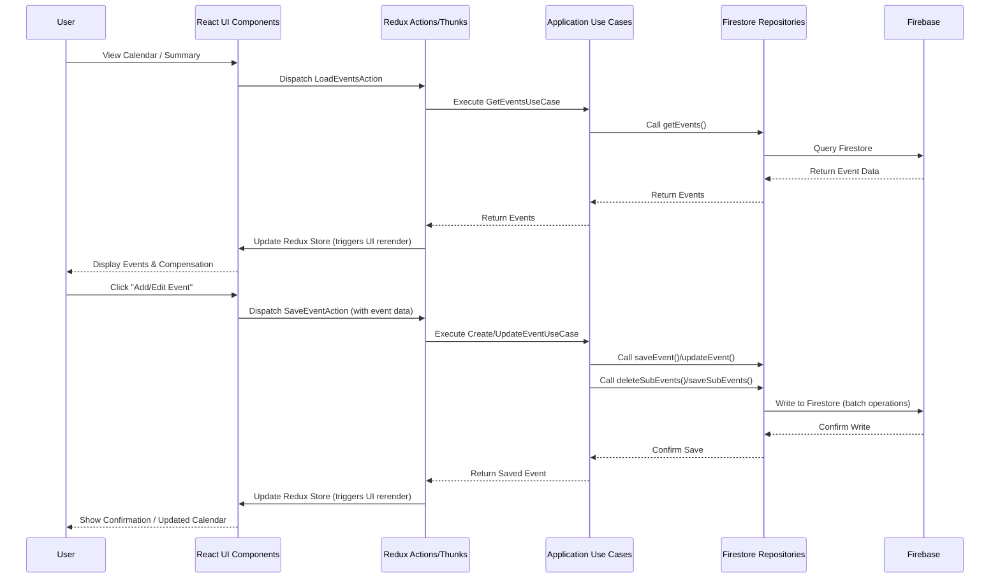
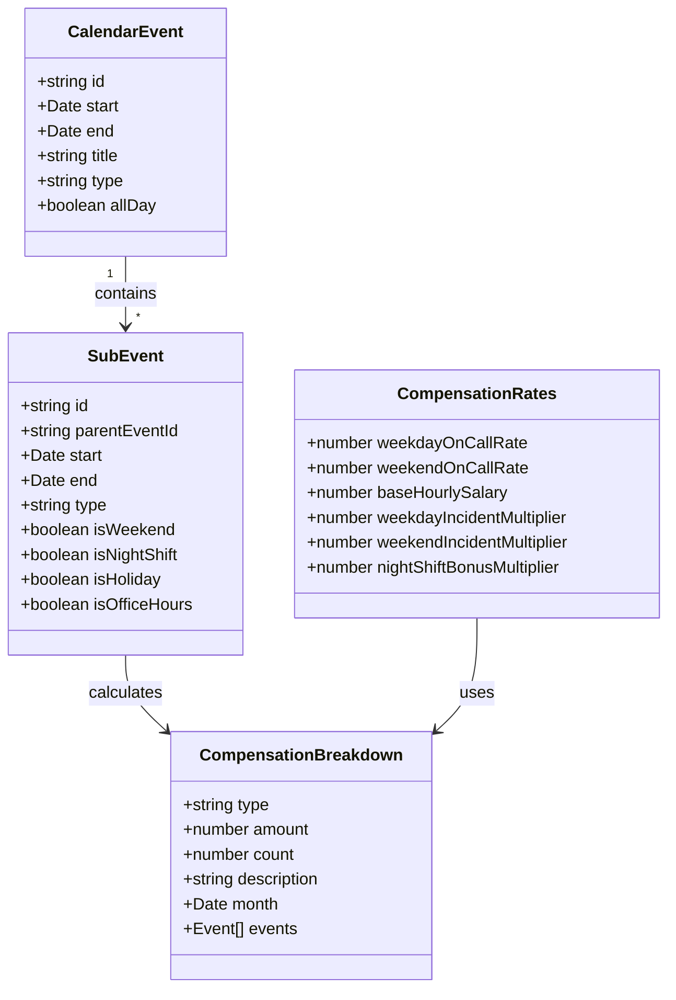

# On-Call & Incident Calendar Calculator

A React-based calendar application for tracking on-call shifts, managing incidents, and calculating compensation with advanced visualization.

## Features

### Core Functionality
- **Interactive Calendar Interface**: Manage on-call shifts and incidents with an intuitive UI
- **Automatic Compensation Calculation**: 
  - Differentiated weekday/weekend rates
  - Night shift bonuses (40% premium)
  - Incident response multipliers
  - Holiday detection
- **Monthly Compensation Summaries**: Visual breakdown of earnings with charts
- **Detailed Analytics**: Hour tracking and compensation distribution
- **Firebase Firestore Persistence**: All data is stored in Firestore, linked to authenticated users.
- **User Authentication**: Secure user sign-up and login.

### Key Modules
1. **Calendar View**: Main interface for adding and managing events
2. **Event Editor**: Create and modify on-call shifts and incidents
3. **Monthly Summary**: Visual breakdown of compensation with charts and detailed analysis
   - Hours breakdown by category (bar chart)
   - Compensation distribution (pie chart)
   - Detailed event listings

## Tech Stack

- **Frontend**: React 18 with TypeScript
- **State Management**: Redux Toolkit, React Hooks (useState, useContext, useMemo)
- **Styling**: Emotion (styled-components)
- **Date Handling**: date-fns
- **Calendar Component**: FullCalendar
- **Charts**: Custom SVG-based charts
- **Backend & Database**: Firebase (Firestore for database, Firebase Authentication for user management)
- **Build Tool**: Vite
- **Error Handling**: Centralized error tracking and logging

## System Architecture

Below are visual representations of the application's architecture and key processes.

### Application Architecture



### Compensation Calculation Flow



### Event Lifecycle



## Architecture & Design Patterns

This application follows a clean, domain-driven architecture with clear separation of concerns:

### Architecture Patterns
- **Domain-Driven Design (DDD)**: Business logic encapsulated in domain entities and services
- **Clean Architecture**: Clear separation between domain, application, presentation, and infrastructure layers.
- **Functional Core, Imperative Shell**: Pure business logic with side effects at the edges (primarily within use cases and repositories).

### Design Patterns
- **Singleton Pattern**: Services can be singletons if appropriate (e.g., domain services not holding state).
- **Facade Pattern**: CompensationCalculatorFacade provides a unified interface to complex subsystems.
- **Repository Pattern**: Abstracts data persistence, with implementations for Firebase Firestore.
- **Factory Pattern**: Creation of entities with complex initialization (e.g., SubEventFactory).
- **Observer Pattern**: Implemented via React state/props and more broadly with Redux for global state management and UI updates in response to state changes.
- **Strategy Pattern**: Different compensation strategies based on event types/time (embedded in compensation logic).
- **Use Cases (Application Services)**: Encapsulate application-specific logic, orchestrating domain objects and repositories.

### Component Interaction Diagram



### Code Organization Principles
- **Single Responsibility Principle**: Each component and service has a clear, focused purpose
- **Dependency Inversion**: High-level modules don't depend on low-level modules
- **Immutability**: State is treated as immutable for predictability

## Project Structure

```
src/
├── application/       # Application-specific logic (use cases)
│   └── calendar/
│       └── use-cases/
├── domain/            # Core business logic, entities, and domain service interfaces
│   ├── calendar/      # Core calendar domain
│   │   ├── constants/ # Business constants like compensation rates
│   │   ├── entities/  # Domain entities (CalendarEvent, SubEvent)
│   │   ├── repositories/ # Repository interfaces (CalendarEventRepository, SubEventRepository)
│   │   ├── services/  # Domain services (SubEventFactory, EventCompensationService)
│   │   └── types/     # TypeScript types and interfaces
│
├── infrastructure/    # Implementation of external concerns (e.g., Firebase)
│   └── storage/       # Firestore repository implementations
│
├── presentation/      # React components, UI logic, Redux store, and hooks
│   ├── components/    # UI components (Calendar, Modals, etc.)
│   │   ├── calendar/
│   │   └── common/
│   ├── store/         # Redux Toolkit store, slices, and thunks
│   │   ├── slices/
│   │   └── thunks/
│   ├── hooks/         # Custom React hooks
│   └── services/      # Presentation-layer services (e.g., CompensationCalculatorFacade)
│
└── utils/             # Shared utilities for dates, logging, error handling etc.
```

## Data Model



## Compensation Calculation Logic

Compensation is calculated based on several factors:

1. **On-Call Compensation**:
   - Weekday on-call: €3.90/hour (outside office hours)
   - Weekend on-call: €7.34/hour

2. **Incident Response**:
   - Base hourly rate: €33.50/hour
   - Weekday multiplier: 1.8x (€60.30/hour)
   - Weekend multiplier: 2.0x (€67.00/hour)
   - Night shift bonus: Additional 1.4x multiplier

3. **Office Hours**:
   - Monday-Friday, 9:00-18:00: Regular work hours, no on-call compensation

## Backend / Cloud Services

This application uses Firebase for its backend needs:
- **Firebase Authentication**: Manages user sign-up, login, and session persistence.
- **Firebase Firestore**: A NoSQL document database used to store all calendar event data, sub-event data, and user-specific information. Data is structured per user, ensuring data privacy.
- **Firestore Security Rules**: (Recommended) Should be configured to ensure that users can only access and modify their own data.

## Getting Started

To run this project locally, you'll need to set up Firebase and configure the application to connect to your Firebase project.

**Prerequisites:**
- Node.js (version >=16.0.0 recommended, as per `package.json`)
- npm (usually comes with Node.js)
- A Google account to create a Firebase project.

**Steps:**

1.  **Clone the repository:**
    ```bash
    git clone https://github.com/RoyCrivolotti/calendar-calculator.git
    cd calendar-calculator
    ```

2.  **Install dependencies:**
    ```bash
    npm install
    ```

3.  **Set up Firebase:**
    *   Go to the [Firebase Console](https://console.firebase.google.com/).
    *   Click on "Add project" and follow the steps to create a new Firebase project.
    *   Once your project is created, navigate to Project Settings (click the gear icon next to "Project Overview").
    *   In the "General" tab, scroll down to "Your apps".
    *   Click on the Web icon (`</>`) to add a web app to your project.
    *   Register your app (give it a nickname, e.g., "Calendar Calculator App"). Firebase Hosting setup is optional at this stage.
    *   After registering, Firebase will provide you with a `firebaseConfig` object. **Copy this object.**

4.  **Configure Firebase in the application:**
    *   In the project's source code, locate or create the Firebase configuration file. This is typically `src/firebaseConfig.ts`.
    *   The file should look something like this (if it doesn't exist, create it):
        ```typescript
        // src/firebaseConfig.ts
        import { initializeApp } from "firebase/app";
        import { getFirestore } from "firebase/firestore";
        import { getAuth } from "firebase/auth";

        // TODO: Replace with your actual Firebase project configuration
        const firebaseConfig = {
          apiKey: "YOUR_API_KEY",
          authDomain: "YOUR_AUTH_DOMAIN",
          projectId: "YOUR_PROJECT_ID",
          storageBucket: "YOUR_STORAGE_BUCKET",
          messagingSenderId: "YOUR_MESSAGING_SENDER_ID",
          appId: "YOUR_APP_ID",
          measurementId: "YOUR_MEASUREMENT_ID" // Optional
        };

        // Initialize Firebase
        const app = initializeApp(firebaseConfig);
        const db = getFirestore(app);
        const auth = getAuth(app);

        export { db, auth, app };
        ```
    *   **Replace the placeholder `firebaseConfig` values with the actual values you copied from the Firebase console.**

5.  **Set up Firestore Database and Authentication:**
    *   In the Firebase console, navigate to "Firestore Database" in the left-hand menu.
    *   Click "Create database".
    *   Choose to start in **test mode** for initial development (this allows open access; you should secure it with security rules later). Select your region.
    *   Navigate to "Authentication" in the left-hand menu.
    *   Go to the "Sign-in method" tab.
    *   Enable the "Email/Password" provider (or any other providers you wish to support).

6.  **Start the development server:**
    ```bash
    npm run dev
    ```
    This will typically open the application in your default web browser, usually at `http://localhost:5173` (Vite's default).

7.  **(Recommended) Secure your Firestore Data:**
    *   After initial setup and testing, go back to the Firebase console -> Firestore Database -> Rules.
    *   Implement security rules to ensure users can only read/write their own data. For example:
        ```
        rules_version = '2';
        service cloud.firestore {
          match /databases/{database}/documents {
            // Allow users to read and write only their own documents in the 'users' collection
            match /users/{userId}/{document=**} {
              allow read, write: if request.auth != null && request.auth.uid == userId;
            }
          }
        }
        ```

## Development Notes

- **Performance Optimization**: Heavy calculations are memoized using React's useMemo
- **Data Consistency**: Compensation calculations are centralized to ensure consistency
- **Error Handling**: Comprehensive error tracking with the logger utility
- **Extensibility**: New compensation types can be added by extending the existing patterns

## License

MIT
