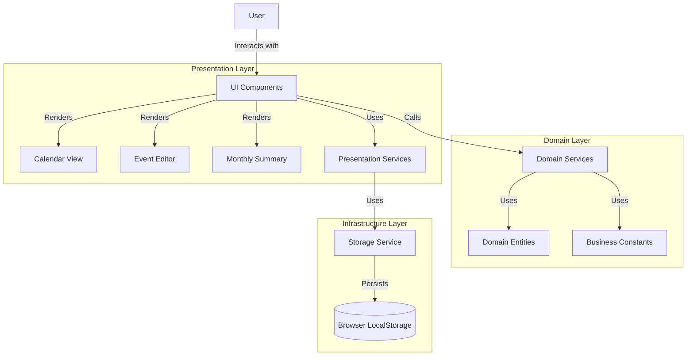
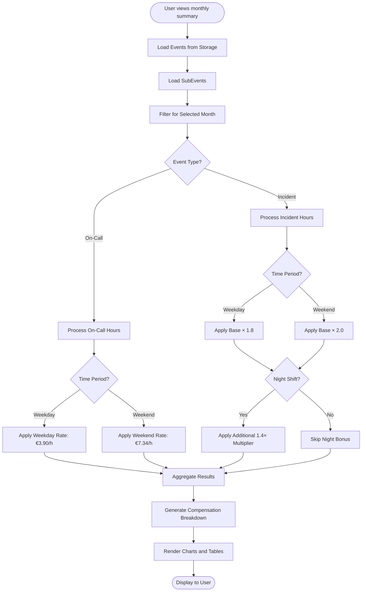
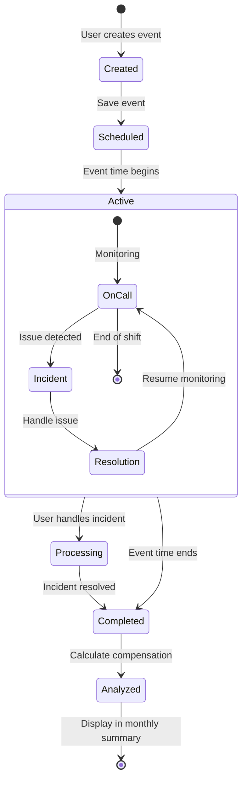
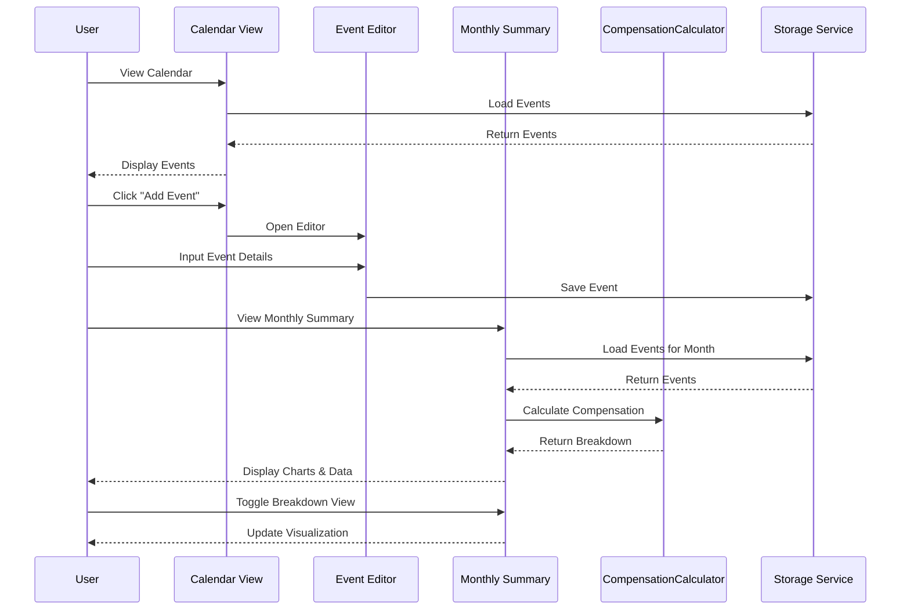
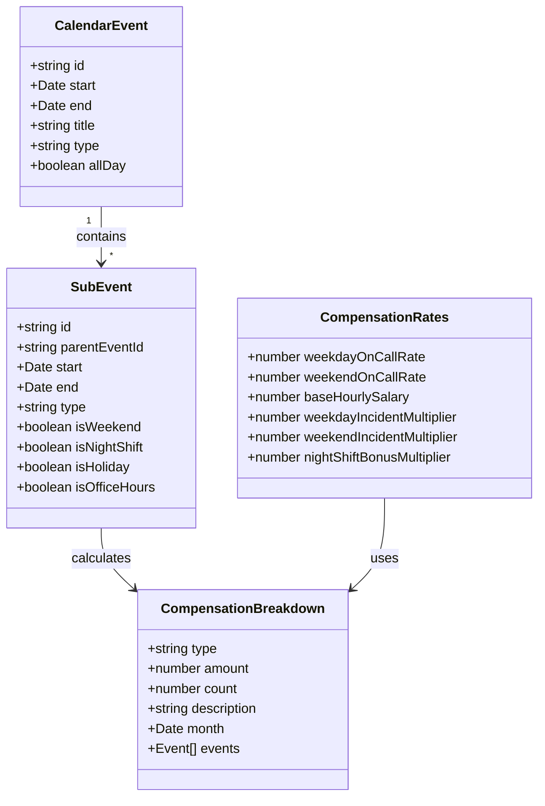

# On-Call & Incident Calendar Calculator

A React-based calendar application for tracking on-call shifts, managing incidents, and calculating compensation with advanced visualization.

## Features

### Core Functionality
- **Interactive Calendar Interface**: Manage on-call shifts and incidents with an intuitive UI
- **Automatic Compensation Calculation**: 
  - Differentiated weekday/weekend rates
  - Night shift bonuses (40% premium)
  - Incident response multipliers
  - Holiday detection
- **Monthly Compensation Summaries**: Visual breakdown of earnings with charts
- **Detailed Analytics**: Hour tracking and compensation distribution
- **Local Storage Persistence**: All data is stored locally in the browser

### Key Modules
1. **Calendar View**: Main interface for adding and managing events
2. **Event Editor**: Create and modify on-call shifts and incidents
3. **Monthly Summary**: Visual breakdown of compensation with charts and detailed analysis
   - Hours breakdown by category (bar chart)
   - Compensation distribution (pie chart)
   - Detailed event listings

## Tech Stack

- **Frontend**: React 18 with TypeScript
- **State Management**: React Hooks (useState, useContext, useMemo)
- **Styling**: Emotion (styled-components)
- **Date Handling**: date-fns
- **Calendar Component**: FullCalendar
- **Charts**: Custom SVG-based charts
- **Storage**: Browser LocalStorage with structured serialization
- **Error Handling**: Centralized error tracking and logging

## System Architecture

Below are visual representations of the application's architecture and key processes.

### Application Architecture



### Compensation Calculation Flow



### Event Lifecycle



## Architecture & Design Patterns

This application follows a clean, domain-driven architecture with clear separation of concerns:

### Architecture Patterns
- **Domain-Driven Design (DDD)**: Business logic encapsulated in domain entities and services
- **Clean Architecture**: Clear separation between domain, presentation, and infrastructure
- **Functional Core, Imperative Shell**: Pure business logic with side effects at the edges

### Design Patterns
- **Singleton Pattern**: Services implemented as singletons (CompensationService, EventCompensationService)
- **Facade Pattern**: CompensationCalculatorFacade provides a unified interface to complex subsystems
- **Repository Pattern**: Storage service abstracts data persistence
- **Factory Pattern**: Creation of entities with complex initialization
- **Observer Pattern**: React state management for UI updates
- **Strategy Pattern**: Different compensation strategies based on event types/time

### Component Interaction Diagram



### Code Organization Principles
- **Single Responsibility Principle**: Each component and service has a clear, focused purpose
- **Dependency Inversion**: High-level modules don't depend on low-level modules
- **Immutability**: State is treated as immutable for predictability

## Project Structure

```
src/
├── domain/            # Business logic, entities, and domain services
│   ├── calendar/      # Core calendar domain
│   │   ├── constants/ # Business constants like compensation rates
│   │   ├── entities/  # Domain entities (CalendarEvent, SubEvent)
│   │   ├── services/  # Domain services (CompensationService)
│   │   └── types/     # TypeScript types and interfaces
│
├── presentation/      # React components and UI logic
│   ├── components/    # UI components
│   │   ├── calendar/  # Calendar-specific components
│   │   └── common/    # Shared/reusable components
│   ├── hooks/         # Custom React hooks
│   └── services/      # Presentation-layer services (Storage)
│
└── utils/             # Shared utilities for dates, logging, etc.
```

## Data Model



## Compensation Calculation Logic

Compensation is calculated based on several factors:

1. **On-Call Compensation**:
   - Weekday on-call: €3.90/hour (outside office hours)
   - Weekend on-call: €7.34/hour

2. **Incident Response**:
   - Base hourly rate: €33.50/hour
   - Weekday multiplier: 1.8x (€60.30/hour)
   - Weekend multiplier: 2.0x (€67.00/hour)
   - Night shift bonus: Additional 1.4x multiplier

3. **Office Hours**:
   - Monday-Friday, 9:00-18:00: Regular work hours, no on-call compensation

## Getting Started

1. Clone the repository:
```bash
git clone https://github.com/RoyCrivolotti/calendar-calculator.git
cd calendar-calculator
```

2. Install dependencies:
```bash
npm install
```

3. Start the development server:
```bash
npm run dev
```

## Development Notes

- **Performance Optimization**: Heavy calculations are memoized using React's useMemo
- **Data Consistency**: Compensation calculations are centralized to ensure consistency
- **Error Handling**: Comprehensive error tracking with the logger utility
- **Extensibility**: New compensation types can be added by extending the existing patterns

## License

MIT
